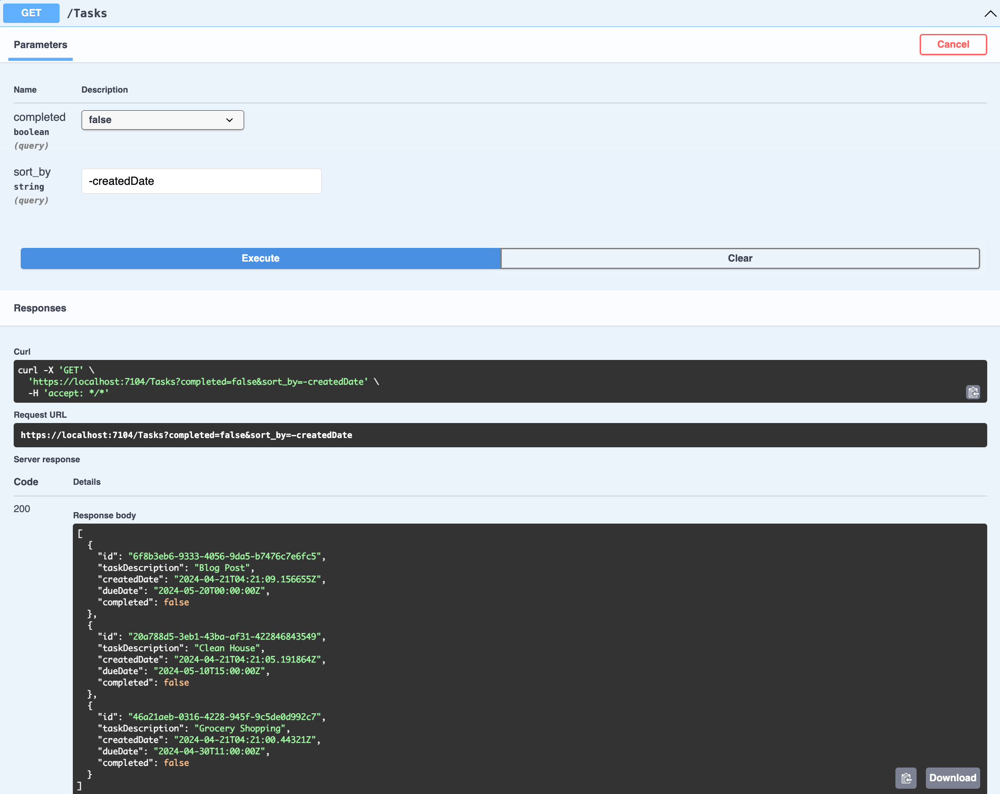

# 📝 Todo API

A **REST API** service for the following **Todo** app interface.

> 
> 
> 

## 👨🏻‍💻 About
- Developed by **[Sameer Mungole](https://www.linkedin.com/in/sameer-mungole/)**
- Design Specifications: [Figma](https://www.figma.com/file/eH8JMqomFAgHsGgb4B50QO/Pages?type=design&node-id=0-1&mode=design)
- API Specifications: *[Docs/API.md](Docs/API.md)*

> **NOTE:**  I've updated the **[API specifications](Docs/API.md)** to accurately represent this 
> service's request and response data, along with detailed description of the different types of 
> errors each request is capable of generating. I urge you to take a look at it in order to 
> understand the service better.

### Technologies
- [ASP.NET 8](https://dotnet.microsoft.com/en-us/download) (version `8.0.204`)
- dotnet CLI (Bundled with **ASP.NET 8**)
- Code Editor: [VSCode](https://code.visualstudio.com/download)
- VSCode extensions:
  - [C#](https://marketplace.visualstudio.com/items?itemName=ms-dotnettools.csharp) by *Microsoft*
  - [Rest Client](https://marketplace.visualstudio.com/items?itemName=humao.rest-client) by *Huachao Mao*
- Swagger

## 🏃‍➡️ Build and run

Start the application in `http` mode:
```console
% dotnet build
% dotnet run --project Todo
```

To start the app in `https` mode, add the **HTTPS development certificates** to trusted 
certificates:
```console
% dotnet dev-certs https --trust
Successfully trusted the existing HTTPS certificate.
```

Then select `https` launch profile while starting the application:
```console
% dotnet build
% dotnet run --launch-profile https --project Todo
```

## 🥸 Test

### Swagger

To test the **APIs**, you can access **Swagger** at:
- [http://localhost:5181/swagger/index.html](http://localhost:5181/swagger/index.html)
- [https://localhost:7104/swagger/index.html](https://localhost:7104/swagger/index.html)



### Rest Client

Make sure you have the [Rest Client](https://marketplace.visualstudio.com/items?itemName=humao.rest-client) 
plugin installed on your **VS Code**.

- Navigate to *[Requests/](Requests)* folder, open files with the `.http` extension.
- You should see a `Send Request` button on top of your **HTTP Request** definition.
- Click `Send Request` button to see the **HTTP Response** in a new tab.


## 🏗️ Architecture

> 
> 

- CRUD REST API
- Functional Programming
- Domain-Driven Design
- Concurrency First
- Best Practices

> **NOTE:** Not every backend system needs to follow **Clean Architecture** and
> **Domain-Driven Design** principles, especially when the application is small/medium. It can add
> a few layer of complexity which aren't always worth the effort.

This project incorporates some principles from the **Domain-Driven Design** to make the application
more resilient and better organized.

I’ve tried to make the app scalable and modular to easily integrate new functionalities as well as 
update existing ones. For example, the app currently uses **in-memory** database for storing and 
retrieving **Todo** tasks. When I do decide to add persistent storage, I would (ideally) only need 
to update the service responsible for this without affecting other parts of the application.

### Design

- When creating a new **webapi** project using **.NET**, we have the option to either go with 
  **Minimal APIs** or **Controller-based APIs**.
- I have opted to go with the later, as this is a standalone service responsible for managing all 
  **Todo** requests and responses.
- Whereas, **Minimal APIs** are ideal for micro-services and apps that want to include only the 
  minimum files, features, and dependencies.

**I have created two projects:**

1. A model for our **API**.
2. An application with the actual logic.

Having your **API** definition which is a bunch of `C#` classes in a separate project allows you to
define it as a class library and then publish it as a `nuget` package. If your client is written
in **.NET**, it can simply consume this `nuget` package instead of remodeling the **APIs**
themselves.

This also works well with **versioning**. So as your **API** evolves and you have a new version,
then when you want to publish the `v2` of your **API**, all you need to do is publish a new `nuget`
package, and all the client needs to do is consume the new package.

## ⚙️ Setup

Create a template `.gitignore` for a **dotnet** project:
```console
% dotnet new gitignore
```

Create a **Todo** solution:
```console
% dotnet new sln -o Todo
The template "Solution File" was created successfully.
```

Create **Contracts** project: (stores models representing the *[API Specification](Docs/API.md)*)
```console
% dotnet new classlib -o Todo.Contracts
The template "Class Library" was created successfully.
```

Create a new **webapi** app using the **controllers** template:
```console
% dotnet new webapi --use-controllers -o Todo
The template "ASP.NET Core Web API" was created successfully.
```

Try building the project:
```console
% dotnet build
Build succeeded.
warning : Unable to find a project to restore!
```

> **NOTE:** When working with the dotnet CLI, its not enough to just create the projects because if 
> we look at the solution file then we can see its still empty and there are actually no projects.

Add both of our projects to the solution file:
```console
% dotnet sln add Todo.Contracts Todo
```

You can cross-verify the added projects in the *[Todo.sln](Todo.sln)*.

In the *[Todo.Contracts.csproj](Todo.Contracts/Todo.Contracts.csproj)* you will find the class 
library. We are using the **.NET SDK**, notice that we have `Nullable` reference types enabled, 
which basically means that if we haven't defined that an object can be `null` then it can't be 
`null`.

*[Todo/](Todo)* is our **webapi**. As we created the project from the **dotnet CLI** using the 
**webapi** template with `--use-controllers` flag, we get a few things out of the box. Here in the
*[Todo.csproj](Todo/Todo.csproj)* we are using the **.NET WEB SDK** and we also have the `Nullable` 
reference types enabled.

### Contracts

Create the *[Tasks](Todo.Contracts/Tasks)* request and response models under 
[Todo.Contracts/](Todo.Contracts) based on the given *[API specification](Docs/API.md)*.

> 

Add the **Contract's** namespace to our **Todo** application:
```console
% dotnet add Todo reference Todo.Contracts
```

### Dependencies

Add the `ErrorOr` package to our **Todo** application for error handling:
```console
% dotnet add Todo package ErrorOr
```

### Resources
- [YouTube:](https://www.youtube.com/watch?v=PmDJIooZjBE) Industry Level REST API using .NET 6 – 
  Tutorial for Beginners by *freeCodeCamp.org*
- [Tutorial:](https://learn.microsoft.com/en-us/aspnet/core/tutorials/first-web-api?view=aspnetcore-8.0&tabs=visual-studio) 
  Create a web API with ASP.NET Core by *Microsoft*
- [ErrorOr:](https://github.com/amantinband/error-or) A simple, fluent discriminated union of an 
  error or a result by *Amichai Mantinband*

> **NOTE:** This is actually my first ever **dotnet** project, hence I’ve taken extra efforts in the 
> documentation for this project so that I can revisit this app for reference in the future.
